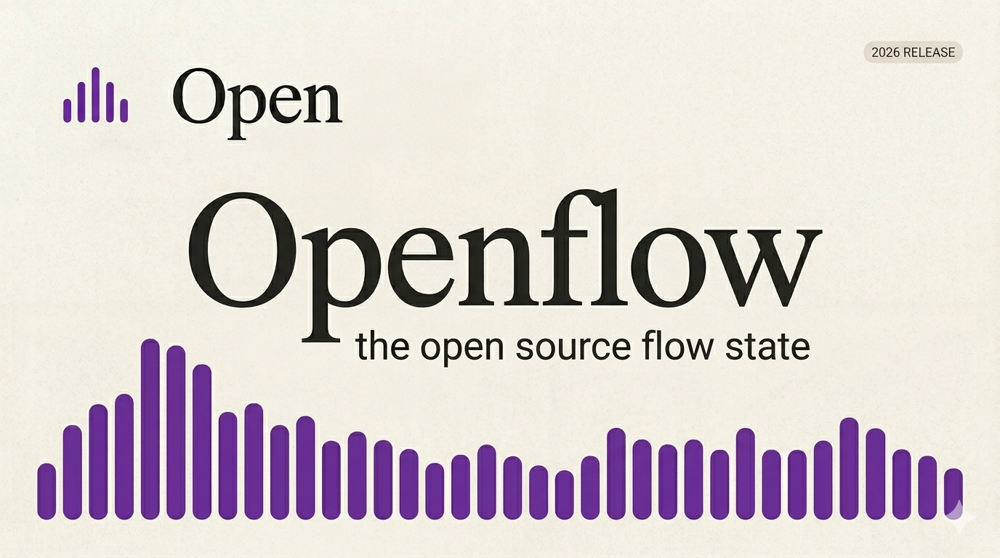

# OpenFlow

Minimal desktop dictation with a floating dock bar, local-first tooling, and optional Groq cleanup.



---

## Why This Exists

OpenFlow is meant to feel like a lightweight writing layer on top of your desktop:

- hit a hotkey
- speak
- get text back in the app you were already using

It keeps the useful parts local:

- history
- snippets
- dictionary terms
- writing styles
- runtime settings

No backend is required for those features.

---

## Features

### Core
- global hotkey dictation
- floating dock bar
- Windows startup registration
- hide/show dock bar
- local Hub for runtime controls

### Groq
- Groq Whisper transcription
- optional LLM enhancement pass
- cheap default models:
  - `whisper-large-v3-turbo`
  - `llama-3.1-8b-instant`

### Local Tools
- `History`
- `Snippets`
- `Dictionary`
- `Styles`

---

## Screens

### Hub
The Hub is where you:

- save your Groq API key
- configure hotkeys
- turn LLM enhancement on or off
- control startup behavior
- show or hide the dock bar

### Dock Bar
The dock bar is the always-available entry point:

- click the visualizer mark to reopen the Hub
- click the close button to hide the bar and bring the Hub back
- use the hotkey to start dictation

---

## Run In Dev

```bash
cargo run --manifest-path src-tauri/Cargo.toml
```

If Windows says it cannot overwrite `openflow.exe`, stop the running app first:

```powershell
Get-Process openflow -ErrorAction SilentlyContinue | Stop-Process -Force
cargo run --manifest-path src-tauri/Cargo.toml
```

---

## Build

### Dev build

```bash
cargo build --manifest-path src-tauri/Cargo.toml
```

### Windows installer

This project is configured for an NSIS bundle through Tauri.

```bash
cargo tauri build --manifest-path src-tauri/Cargo.toml
```

If `cargo tauri` is missing on your machine, install it first:

```bash
cargo install tauri-cli
```

---

## Project Structure

```text
D:\Projects\openflow
├─ dist
│  ├─ index.html      # Hub UI
│  ├─ hub.css         # Hub styling
│  ├─ hub.js          # Hub logic + local storage
│  ├─ bar.html        # Dock bar UI
│  ├─ bar.css         # Dock bar styling
│  └─ bar.js          # Dock bar behavior
└─ src-tauri
   ├─ src\main.rs     # Native windowing, hotkeys, recording, Groq calls
   └─ tauri.conf.json # App/window/bundle config
```

---

## Current Behavior

- closing the Hub hides it when the dock bar is still active
- startup mode hides the Hub and leaves the app running in the background
- dock bar position is persisted locally
- LLM enhancement can be enabled or disabled in Settings

---

## Good Next Steps

1. Apply dictionary replacements before paste
2. Expand snippets during dictation or command mode
3. Let styles modify the enhancement prompt
4. Export/import local data

---

## Status

This is a working desktop app, not just a mockup.  
The UI, storage, and dictation loop are all local. The only remote dependency is Groq for transcription and optional cleanup.
