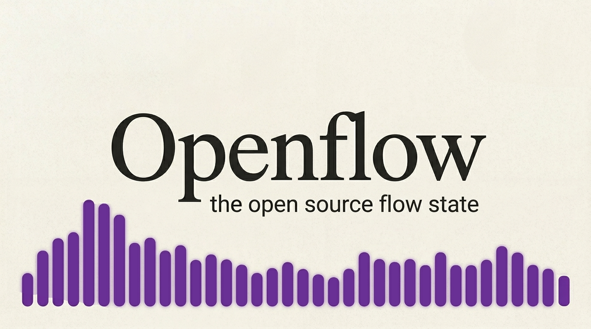
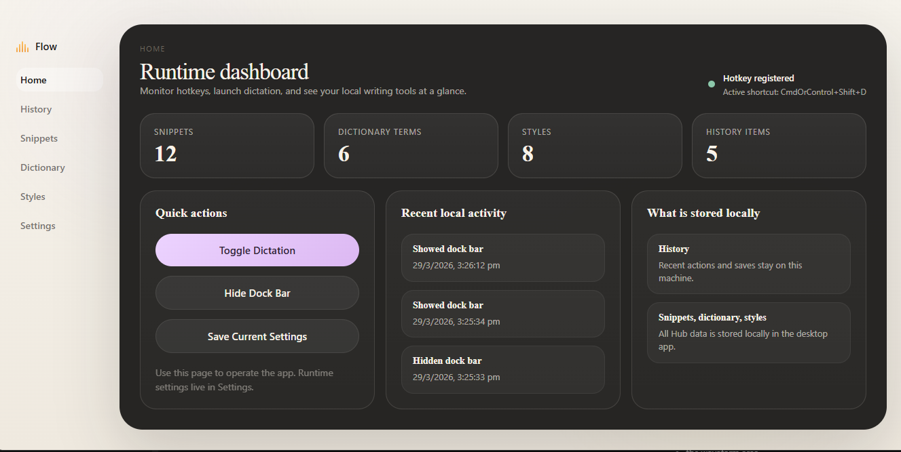

# OpenFlow

<p align="center">
  
</p>

<p align="center">
  
  
  
  
</p>

<p align="center">
  Minimal desktop dictation with a floating dock bar, local-first tools, and optional LLM cleanup.
</p>

---

## Snapshot

<p align="center">
  
</p>

---

## What OpenFlow Is

OpenFlow is a desktop dictation layer for fast writing:

- hit a hotkey
- speak
- get text pasted back into the app you were already using

It keeps the important parts local:

- `History`
- `Snippets`
- `Dictionary`
- `Styles`
- runtime settings
- dock bar position

The only remote dependency is Groq for transcription and optional text cleanup.

---

## Feature Stickers

| Area | Included |
|---|---|
| Dictation | Global hotkey capture, floating dock bar, clipboard paste |
| AI | Groq Whisper transcription, optional Groq cleanup pass |
| Local Tools | Snippets, dictionary terms, writing styles, activity history |
| Desktop | Launch on startup, hide/show dock bar, persistent bar position |
| UI | Hub + minimal dock bar |

---

## Quick Start

### Run in development

```bash
cargo run --manifest-path src-tauri/Cargo.toml
```

### If Windows says `openflow.exe` is locked

```powershell
Get-Process openflow -ErrorAction SilentlyContinue | Stop-Process -Force
cargo run --manifest-path src-tauri/Cargo.toml
```

---

## Installer

OpenFlow is configured for a Windows NSIS bundle.

```bash
cargo tauri build --manifest-path src-tauri/Cargo.toml
```

If `cargo tauri` is not installed:

```bash
cargo install tauri-cli
```

Then enable `Launch on startup` in the app if you want OpenFlow to register itself with Windows startup.

---

## Runtime Modes

### Raw
- transcription only
- no LLM rewrite
- useful when you want exact spoken wording

### Enhanced
- transcription + cleanup pass
- fixes punctuation, capitalization, and rough speech patterns
- useful when you want polished output fast

You can toggle this in `Settings -> LLM enhancement`.

---

## Project Layout

```text
D:\Projects\openflow
├─ assets\readme
│  ├─ openflow-hero-v2.png
│  └─ openflow-screenshot.png
├─ dist
│  ├─ index.html
│  ├─ hub.css
│  ├─ hub.js
│  ├─ bar.html
│  ├─ bar.css
│  └─ bar.js
└─ src-tauri
   ├─ src\main.rs
   └─ tauri.conf.json
```

---

## Current Notes

> OpenFlow is local-first, not backend-first.

- Hub data is stored locally
- the dock bar can be hidden and restored
- startup mode hides the Hub and keeps the background app alive
- model defaults are:
  - `whisper-large-v3-turbo`
  - `llama-3.1-8b-instant`

---

## Next Up

1. Apply dictionary replacements before paste
2. Expand snippets during dictation or command mode
3. Let styles modify the enhancement prompt
4. Export/import local data

---

## Status

<p>
  
  
  
</p>

This is a working desktop app, not just a mockup.
